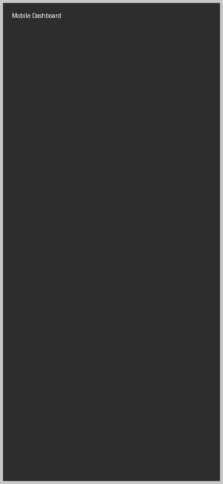
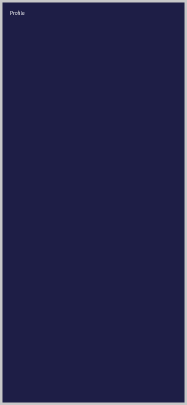

# uniHood


> **Live Demo:** [unihood.app](https://unihood.app) _(Interviewers: feel free to create an account and poke around!)_

uniHood is a real-time, campus-based social platform designed to bring the university "third place" into the digital age. It's not just a chat app; it's a living, breathing digital campus where you can bump into friends, challenge rivals to quick games, and find your community.

## Why I Built This

I built uniHood because I felt that modern social networks have lost the magic of _place_. On a real campus, you don't just "send connection requests"—you see people in the library, you join a pickup game on the quad, or you debate a topic in the student union. Serendipity is key.

I wanted to recreate that feeling of **presence**. That's why uniHood is built around "Activities" and "Rooms" rather than just static feeds. When you're online, you're _somewhere_. You can be active in a Trivia lobby, waiting for a challenger in Rock Paper Scissors, or co-writing a story with a friend.

This project was also my playground to prove that a complex, real-time microservices architecture can feel seamless and snappy on the frontend. I wanted to build something that didn't just work, but felt _alive_.

## Features

### 🎮 Real-time Activities Hub
The heart of uniHood. A dedicated microservice powers a suite of live, interactive games. No refreshing required—everything pushes instantly via WebSockets.
- **Quick Trivia:** 1v1 speed battles. First to answer correctly wins the edge.
- **Rock Paper Scissors:** The classic settler of disputes, reimagined with a tense "reveal" mechanic.
- **Speed Typing:** Test your WPM against a friend in a live race.
- **Story Builder:** Collaborative storytelling where you take turns writing a narrative.
- **Tic Tac Toe:** A quick strategic breaker between classes.

### 📱 Responsive & Mobile-First
I recently overhauled the entire UI to ensure it feels native on any device.
- **Adaptable Layouts:** Sidebars vanish into bottom sheets, grids collapse into stacks, and touch targets expand on mobile.
- **Safe Areas:** Full support for modern mobile viewports (using `dvh` units) so key UI elements never get hidden behind address bars.

### 🏫 Campus Identity
- **University Verification:** Join the network specific to your school.
- **Proximity:** Find events and meetups happening physically near you (when enabled).
- **Profile Completeness:** A gamified onboarding flow to help you build your digital persona.

## Tech Stack

I chose a "best tool for the job" approach, separating the real-time game logic from the heavy-lifting business logic.

- **Frontend:** [Next.js 14](https://nextjs.org/) (App Router), TypeScript, Tailwind CSS, Framer Motion.
- **Backend:** [FastAPI](https://fastapi.tiangolo.com/) (Python) for core business logic, user management, and REST APIs.
- **Microservices:** Node.js + Socket.io for the high-concurrency Activities engine.
- **Database:** PostgreSQL (primary data), Redis (caching, session store, and Pub/Sub).
- **Infrastructure:** Docker Compose for local orchestration.

## Screenshots

| | |
|:---:|:---:|
| **Mobile-First Dashboard** | **Real-Time Trivia** |
|  |  |
| **Story Builder** | **Profile Stats** |
|  |  |

## Local Development

Want to spin this up locally? I've containerized the entire stack so you don't need to manually install Python or Node dependencies locally if you don't want to.

### Prerequisites
- Docker & Docker Compose
- Node.js 18+ (for local frontend dev)

### Quick Start

1. **Clone the repo**
   ```bash
   git clone https://github.com/sia12-web/Divan.git unihood
   cd unihood
   ```

2. **Start the backend & services**
   ```bash
   # This boots up Postgres, Redis, FastAPI, and the Activities service
   docker-compose up -d
   ```

3. **Start the frontend**
   ```bash
   cd frontend
   npm install
   npm run dev
   ```

4. **Visit the app**
   Open [http://localhost:3000](http://localhost:3000) to see it in action!
